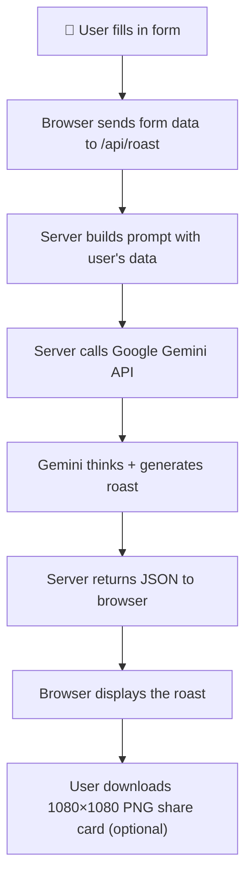
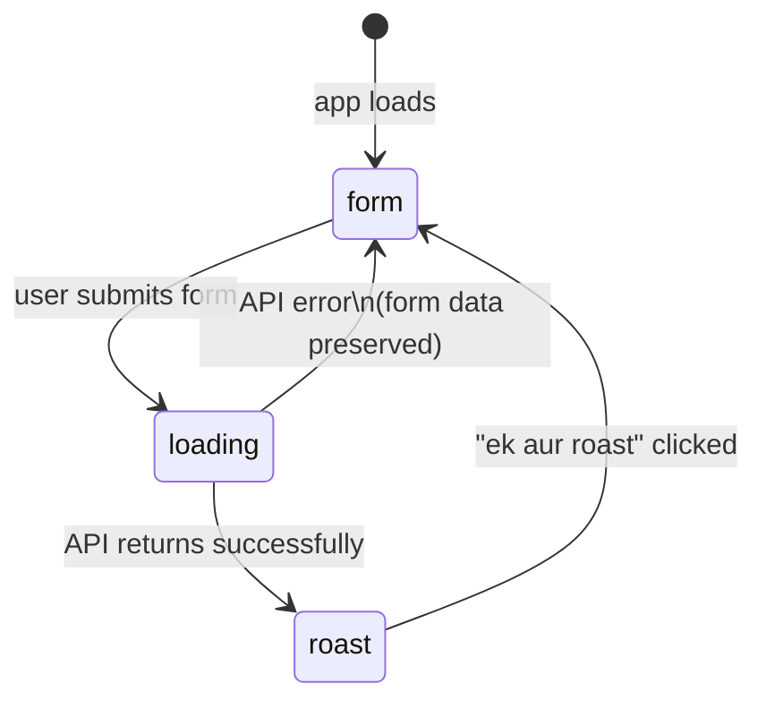
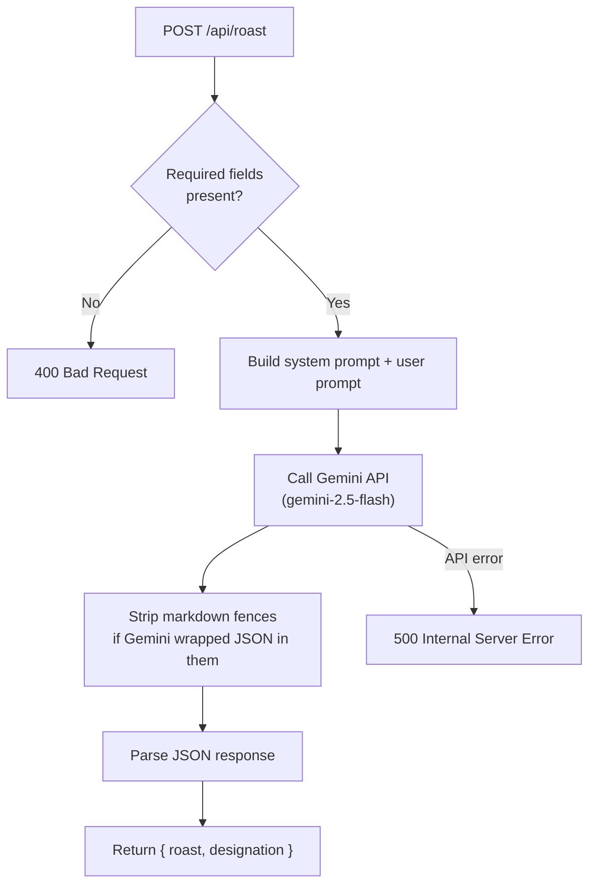
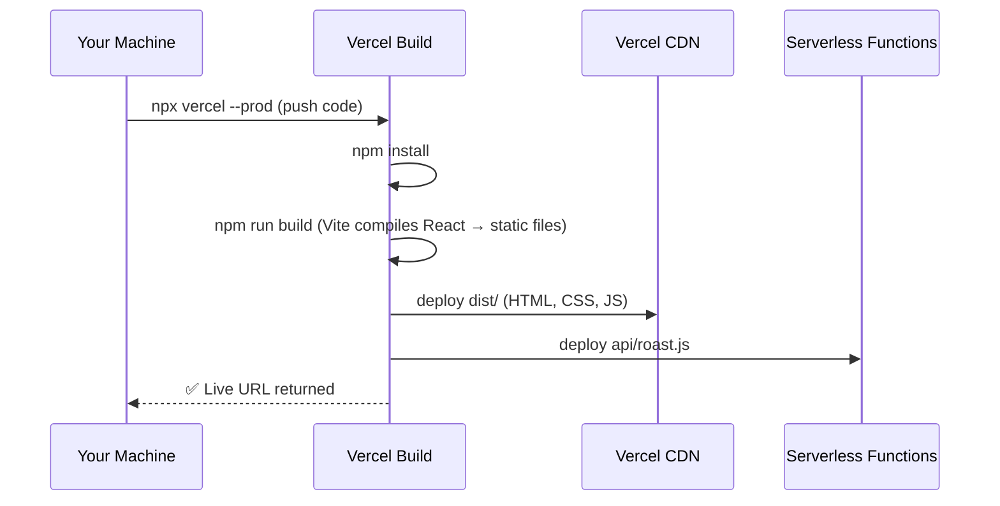
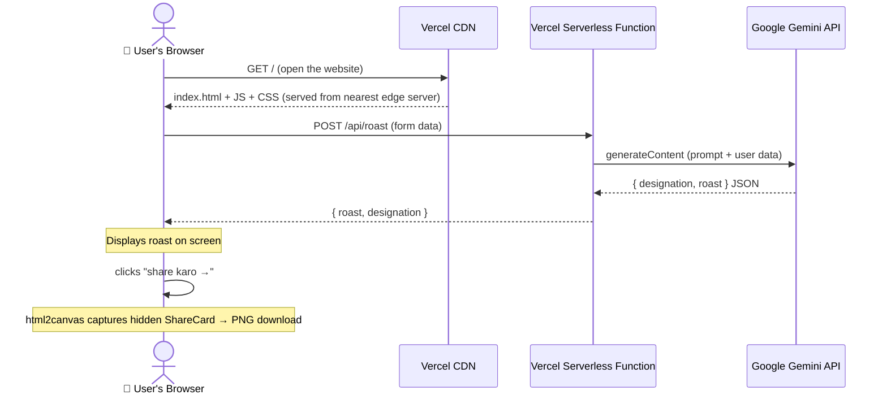

# Roast Me Samay — Full Project Documentation

> Written assuming zero prior knowledge of any technology used. Read top to bottom.

---

## Table of Contents

1. [What is this project?](#1-what-is-this-project)
2. [How does it work? (the big picture)](#2-how-does-it-work-the-big-picture)
3. [Technology stack — what each tool is and why we use it](#3-technology-stack)
4. [Project structure — every file explained](#4-project-structure)
5. [The frontend — how the UI works](#5-the-frontend)
6. [The backend — how the roast is generated](#6-the-backend)
7. [The AI prompt — how we talk to Gemini](#7-the-ai-prompt)
8. [Vercel — what it is and how deployment works](#8-vercel)
9. [Running it locally](#9-running-it-locally)
10. [Environment variables and secrets](#10-environment-variables-and-secrets)
11. [How to make changes and redeploy](#11-how-to-make-changes-and-redeploy)

---

## 1. What is this project?

**Roast Me Samay** is a web app where a user fills in a short form about themselves — their job, city, a recent failure, and a lie they tell themselves on Sunday nights — and receives a short comedy roast written in the voice of Samay Raina (Indian stand-up comedian and chess streamer).

The roast is generated fresh for each user by an AI (Google's Gemini model). The user can also download a shareable 1080×1080 PNG image of their roast.

**Live URL:** https://roast-me-samay.vercel.app

---

## 2. How does it work? (the big picture)



There are three distinct layers:

| Layer | What it does | Technology |
|-------|-------------|------------|
| **Frontend** | The UI the user sees and interacts with | React + Vite + Tailwind |
| **Backend** | A small server function that calls the AI | Vercel Serverless Function (Node.js) |
| **AI** | Generates the actual roast text | Google Gemini 2.5 Flash |

---

## 3. Technology Stack

### React
React is a JavaScript library for building user interfaces. Instead of writing HTML directly, you write **components** — small, reusable pieces of UI that each manage their own logic and appearance.

In React, when data changes (e.g. the user fills in their name), the component automatically re-renders to show the updated UI. You don't manually manipulate the page — React handles that.

**Why we use it:** It makes building interactive UIs like multi-screen forms much simpler than raw HTML/JavaScript.

### Vite
Vite is a **build tool and development server** for JavaScript projects.

When you write modern JavaScript (including React's JSX syntax), browsers can't run it directly — it needs to be transformed into plain JavaScript that browsers understand. Vite does this transformation.

- In **development**, Vite runs a local server (on port 5173) that serves your app and hot-reloads changes instantly as you edit files.
- In **production**, Vite compiles and bundles all your JavaScript and CSS into a small set of optimised files (in the `dist/` folder) that can be served to users.

**Why we use it:** It's fast and simple. The alternative (Webpack) is significantly more complex to configure.

### Tailwind CSS
Tailwind is a **CSS framework** — a system of pre-built utility classes that you apply directly to HTML elements.

Instead of writing a separate CSS file with rules like:
```css
.button {
  padding: 12px 24px;
  background-color: red;
  border-radius: 4px;
}
```

You write the styles inline in the HTML/JSX:
```jsx
<button className="px-6 py-3 bg-red rounded">Click me</button>
```

Each class (`px-6`, `py-3`, `bg-red`) is a single CSS property. Tailwind generates only the CSS classes you actually use, keeping the file size small.

**Why we use it:** Rapid styling without switching between files.

### Node.js / JavaScript (Backend)
Node.js is a runtime that lets you run JavaScript on a server (outside a browser). Our backend API (`api/roast.js`) is a Node.js file.

### Vercel
Vercel is a **cloud hosting platform** — it takes your code and runs it on the internet so anyone can access it. See [Section 8](#8-vercel) for a full explanation.

### Google Gemini API
Gemini is Google's AI model. We send it a prompt (instructions + the user's form data) and it returns generated text — the roast. We access it via an HTTP API (a URL we call with our data). We use the **Gemini 2.5 Flash** model, which is available on Google's free tier.

### html2canvas
A JavaScript library that takes a DOM element (a piece of the webpage) and renders it as an image. We use it to convert the hidden `ShareCard` component into a downloadable PNG file.

---

## 4. Project Structure

```
roast-me-samay/
│
├── api/
│   └── roast.js              ← The backend. Calls Gemini, returns the roast.
│
├── src/
│   ├── main.jsx              ← Entry point. Mounts the React app into the HTML page.
│   ├── App.jsx               ← Root component. Controls which screen is shown.
│   ├── App.css               ← Minimal global styles.
│   │
│   ├── screens/
│   │   ├── FormScreen.jsx    ← The form the user fills in.
│   │   ├── LoadingScreen.jsx ← The spinner shown while the roast is generating.
│   │   └── RoastScreen.jsx   ← Displays the roast + share/restart buttons.
│   │
│   ├── components/
│   │   └── ShareCard.jsx     ← The hidden 1080×1080 card captured as a PNG.
│   │
│   └── styles/
│       └── globals.css       ← All shared CSS classes (pills, buttons, etc.)
│
├── public/                   ← Static files served as-is (favicon etc.)
├── index.html                ← The HTML shell that React mounts into.
├── package.json              ← Lists all dependencies and npm scripts.
├── package-lock.json         ← Exact locked versions of every dependency.
├── vite.config.js            ← Vite configuration.
├── tailwind.config.js        ← Tailwind configuration (custom colours, fonts).
├── postcss.config.js         ← Required by Tailwind to process CSS.
├── vercel.json               ← Vercel configuration (currently empty — defaults work).
├── .npmrc                    ← Forces npm to use the public registry when deploying.
├── .env                      ← Secret environment variables (NOT committed to git).
├── .env.example              ← Template showing which env vars are needed.
└── .gitignore                ← Files git should not track (node_modules, .env, etc.)
```

---

## 5. The Frontend

### How screens work

The app has three screens. There is no URL routing — it's a single HTML page that shows different content based on state.

`App.jsx` controls this with a `screen` variable that can be `'form'`, `'loading'`, or `'roast'`:

```
'form'    → shows FormScreen
'loading' → shows LoadingScreen
'roast'   → shows RoastScreen
```



### Form state preservation on error

If the API call fails, we show an error message and go back to the form — but the user's answers must not be lost. To achieve this, form data is lifted up to `App.jsx` as `savedForm`. When `FormScreen` mounts, it receives `initialData` (the previously saved values) and pre-fills the fields.

### The PillGroup component

Each form question uses a `PillGroup` — a row of selectable pill buttons plus a free-text input for custom answers. Selecting a pill sets the field value; typing in the input also updates it. Clicking the same pill again deselects it.

### The share card

`ShareCard.jsx` renders a 1080×1080 pixel card using inline styles (not Tailwind classes, because html2canvas requires actual CSS values — not utility class names). It's positioned off-screen (`left: -9999px`) so it's never visible to the user, but the browser has rendered it and html2canvas can capture it.

When the user clicks "share karo →":
1. `document.fonts.ready` waits for custom fonts to load (so text doesn't fall back to system fonts in the screenshot)
2. `html2canvas` renders the hidden card to a `<canvas>` element
3. The canvas is converted to a PNG blob
4. A fake `<a>` element is clicked programmatically to trigger a file download

---

## 6. The Backend

### What a serverless function is

Traditionally, a backend server is a program that runs continuously, waiting for requests. A **serverless function** is different — it is a single function that only runs when a request arrives, then shuts down. You pay (or use quota) only for the time it actually runs.

Vercel automatically turns any file inside the `api/` directory into a serverless function. `api/roast.js` becomes the endpoint `/api/roast`.

### What the function does



### The LLM adapter pattern

The `callLLM()` function is isolated so that switching AI providers only requires editing that one function — the prompt building, validation, and response parsing above and below it stay untouched.

```js
// To switch from Gemini to Claude (for example), only edit this function:
async function callLLM(systemPrompt, userPrompt) {
  // ... calls Gemini API ...
}
```

### Gemini API call

```js
fetch(`https://generativelanguage.googleapis.com/v1beta/models/gemini-2.5-flash:generateContent?key=${apiKey}`, {
  method: 'POST',
  body: JSON.stringify({
    system_instruction: { parts: [{ text: systemPrompt }] },
    contents: [{ role: 'user', parts: [{ text: userPrompt }] }],
    generationConfig: {
      maxOutputTokens: 3000,
      temperature: 1,
      thinkingConfig: { thinkingBudget: 8192 }
    }
  })
})
```

**Key parameters:**
- `system_instruction` — The persistent instructions that define who Gemini is and how it should write. Sent with every request.
- `contents` — The specific user message for this request (their form data).
- `temperature: 1` — Controls creativity/randomness. 0 = deterministic, 2 = very random. 1 is a good balance for creative writing.
- `thinkingBudget: 8192` — Gemini 2.5 Flash can "think" internally before writing its response, using up to this many tokens. More thinking = better reasoning = better (funnier) output, at the cost of more token usage. Maximum is 24,576.
- `maxOutputTokens: 3000` — The maximum length of the response. Thinking tokens are separate from output tokens.

---

## 7. The AI Prompt

The prompt is split into two parts:

### System prompt (`SAMAY_SYSTEM_PROMPT`)

Sent with every request. Defines who Gemini is and the rules it follows. It does NOT contain any user-specific data.

Key sections:
- **VOICE** — Describes Samay's comedic tone (baffled, not contemptuous; finding the ridiculous angle; making the person laugh not feel attacked)
- **BEFORE WRITING** — Instructs the model to pick the funniest angle from the inputs rather than trying to use all of them
- **LENGTH AND STRUCTURE** — No fixed paragraph count; under 80 words; stop the moment the funny thing has been said
- **DESIGNATION** — Rules for the fake LinkedIn title
- **NEVER** — A list of things explicitly forbidden (questions at end of paragraphs, self-deprecation, generic observations, etc.)

### User prompt (`buildUserPrompt`)

Built fresh for each request with the person's actual data. Structured into two labelled sections:

```
Context — who they claim to be:
  Name, Age, Job, City, Relationship

Sharp material — who they actually are:
  Recent L, Sunday night lie
```

The label "sharp material" tells the model these two fields are the most useful for finding the funny angle.

The model is asked to respond in **JSON** format:
```json
{
  "designation": "...",
  "roast": "paragraph one\n\nparagraph two"
}
```

Using JSON prevents the model from adding conversational filler ("Here's your roast!") and makes the response reliably parseable.

---

## 8. Vercel

### What Vercel is

Vercel is a platform that hosts web applications. You give it your code and it:
1. Builds your frontend (runs `npm run build`, which runs Vite)
2. Hosts the built files on a global CDN (content delivery network — servers around the world so the page loads fast for everyone)
3. Runs your `api/` functions as serverless functions

### How deployment works



### What happens when a user visits the site



- Static files (HTML, CSS, JS) are served from the CDN — extremely fast, geographically close to the user.
- API calls (`/api/roast`) are routed to the serverless function — spins up on demand, runs the code, shuts down.

### Environment variables on Vercel

Secret values like the Gemini API key cannot be committed to git (it would be public). Instead they are stored in Vercel's dashboard and injected into the serverless function at runtime as `process.env.GEMINI_API_KEY`.

We set this with:
```bash
echo "your-key" | npx vercel env add GEMINI_API_KEY production
```

### The .npmrc fix

Your machine uses an imanage private npm registry (Artifactory) configured in `~/.npmrc`. When Vercel builds the project, it would pick up the credentials from `package-lock.json` (which was originally generated using that registry) and fail with a 401 auth error.

Fix: a project-level `.npmrc` file sets the registry back to the public npm registry. Project-level config overrides global config.

```
# .npmrc
registry=https://registry.npmjs.org/
```

---

## 9. Running it locally

### Prerequisites
- Node.js installed
- A Gemini API key (free at https://aistudio.google.com/app/apikey)
- A Vercel account (free) and `vercel` CLI

### Setup

```bash
# 1. Install dependencies
npm install

# 2. Create your env file
cp .env.example .env
# Then edit .env and add your Gemini API key:
# GEMINI_API_KEY=your_key_here

# 3. Start the local development server
npx vercel@51 dev
```

`vercel dev` is used instead of `npm run dev` because it simulates the full Vercel environment locally — including running the `api/` serverless functions. Plain `npm run dev` (which runs Vite only) would serve the frontend but `/api/roast` calls would fail.

The app runs at **http://localhost:3000**.

### Why vercel@51 specifically?

The latest Vercel CLI (v52) requires Node.js 20.19+ but the local machine runs 20.17. Pinning to v51 avoids this mismatch.

---

## 10. Environment Variables and Secrets

| Variable | Where it lives | What it's for |
|----------|---------------|---------------|
| `GEMINI_API_KEY` | `.env` locally, Vercel dashboard in production | Authenticates API calls to Google Gemini |

**Never commit `.env` to git.** It is listed in `.gitignore`. Anyone with the API key can make requests that count against your Gemini quota.

`.env.example` is committed — it shows the shape of the config without real values:
```
GEMINI_API_KEY=
```

---

## 11. How to make changes and redeploy

### Changing the UI
Edit files in `src/`. The local dev server (vercel dev) hot-reloads automatically — you'll see changes in the browser immediately without refreshing.

### Changing the roast prompt
Edit `SAMAY_SYSTEM_PROMPT` or `buildUserPrompt` in `api/roast.js`. Test locally by submitting the form at http://localhost:3000. No restart needed — serverless functions are re-read on each request in dev mode.

### Changing the AI model or parameters
Edit the `callLLM` function in `api/roast.js`. Only this function needs to change to switch providers. Parameters of interest:
- `temperature` — higher = more creative/random
- `thinkingBudget` — higher = better reasoning but slower and uses more token quota
- `model` — change `gemini-2.5-flash` to another model name

### Deploying changes to production

```bash
npx vercel@51 --prod
```

That's it. Vercel re-builds and redeploys. The whole process takes ~30 seconds.

### Adding new environment variables

```bash
echo "your-value" | npx vercel@51 env add VARIABLE_NAME production
```

Then redeploy for the change to take effect.
